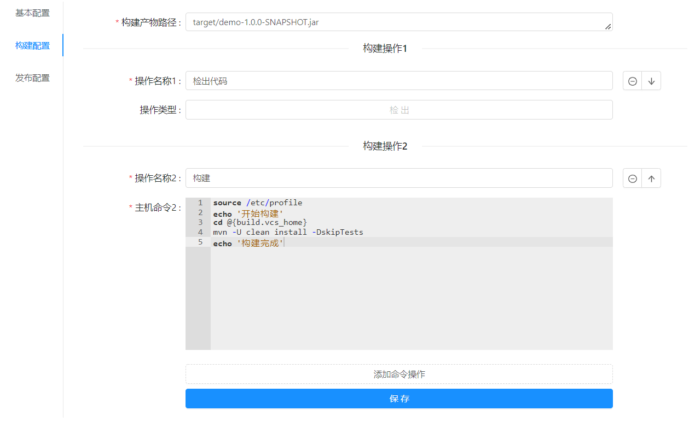
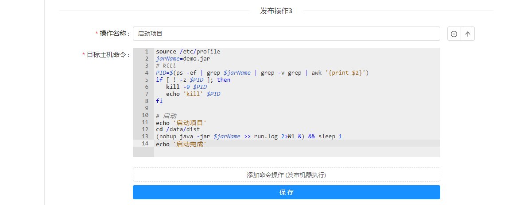

#### springboot 项目模板

以一个普通的 maven 构建的 springboot 项目为例  
构建操作为: `checkout` > `maven build`  
发布操作为: `删除旧版文件` > `传输文件` > `nohup java -jar demo-1.0.0-SNAPSHOT.jar &`  
<br/>

> 构建配置



> 发布配置




#### 构建配置

> 构建产物路径

```
构建产物路径一般是在代码目录下的 target/xxx.jar
target/demo-1.0.0-SNAPSHOT.jar
```  

> 构建操作1 检出代码

无需操作

> 构建操作2 构建应用

```
source /etc/profile
echo '开始构建'
cd @{build.vcs_home}
mvn -U clean install -DskipTests
echo '构建完成'
```

#### 发布配置

> 发布操作1 删除旧版文件

```
jarFile=/data/dist/demo.jar
if [ -f "$jarFile" ]; then
 rm -rf $jarFile
 echo '删除/data/dist/demo.jar'
fi
```

> 发布操作2 传输文件

```
设置一个传输产物文件的绝对路径
/data/dist/demo.jar
```

> 发布操作3 启动项目

```
source /etc/profile
jarName=demo.jar
# kill
PID=$(ps -ef | grep $jarName | grep -v grep | awk '{print $2}')
if [ ! -z $PID ]; then
   kill -9 $PID
   echo 'kill' $PID
fi

# 启动
echo '启动项目'
cd /data/dist
(nohup java -jar $jarName >> run.log 2>&1 &) && sleep 1
echo '启动完成'
```

