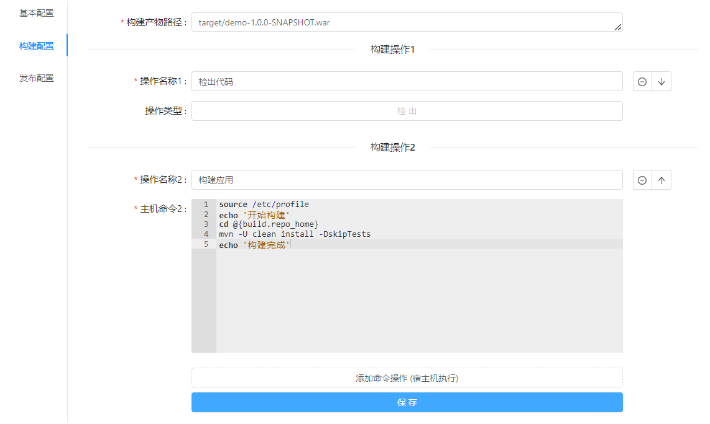
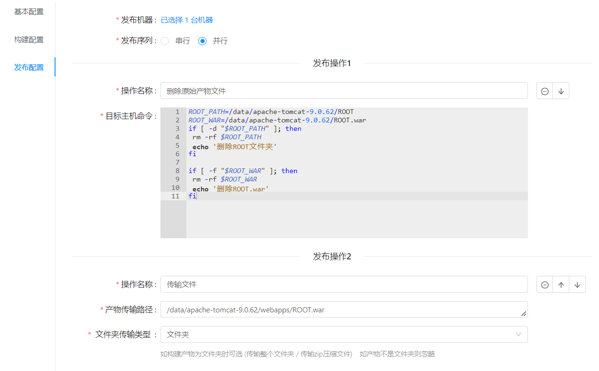
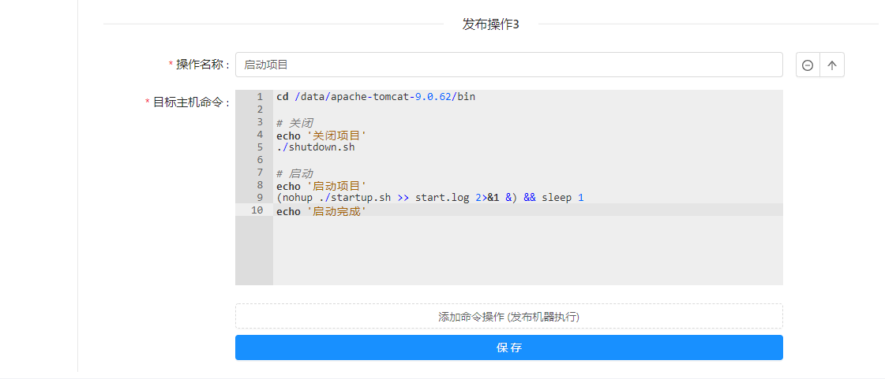

### tomcat 项目模板

以一个普通的 maven 构建的 web 项目为例  
构建操作为: `checkout` > `maven build`  
发布操作为: `删除 tomcat/webapps/ROOT 和 ROOT.war` > `传输ROOT.war` > `shutdown.sh` > `startup.sh`  
<br/>

> 构建配置预览



> 发布配置预览




### 构建配置

> 构建产物路径

```
构建产物路径一般是在代码目录下的 target/xxx.war
target/demo-1.0.0-SNAPSHOT.war
```  

> 构建操作1 检出代码

无需操作

> 构建操作2 构建应用

```
source /etc/profile
echo '开始构建'
cd @{build.repo_home}
mvn -U clean install -DskipTests
echo '构建完成'
```

### 发布配置

> 发布操作1 删除原有文件

```
ROOT_PATH=/data/apache-tomcat-9.0.62/ROOT
ROOT_WAR=/data/apache-tomcat-9.0.62/ROOT.war
if [ -d "$ROOT_PATH" ]; then
 rm -rf $ROOT_PATH
 echo '删除ROOT文件夹'
fi

if [ -f "$ROOT_WAR" ]; then
 rm -rf $ROOT_WAR
 echo '删除ROOT.war'
fi
```

> 发布操作2 传输文件

```
传输产物文件的绝对路径应该为 tomcat/webapps 下的 ROOT.war 或 项目名称.war
/data/apache-tomcat-9.0.62/webapps/ROOT.war
```

> 发布操作3 启动项目

```
cd /data/apache-tomcat-9.0.62/bin

# 关闭
echo '关闭项目'
./shutdown.sh

# 启动
echo '启动项目'
(nohup ./startup.sh >> start.log 2>&1 &) && sleep 1
echo '启动完成'
```

